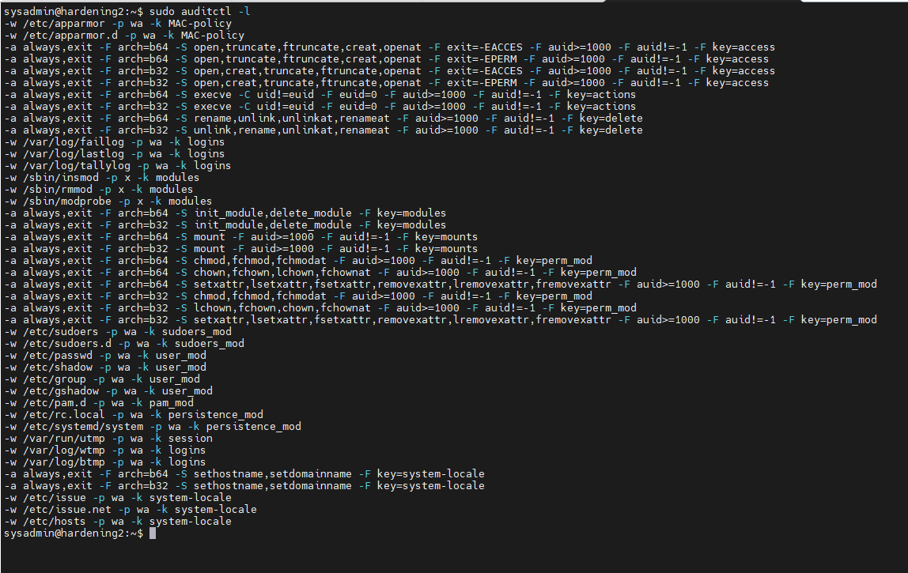
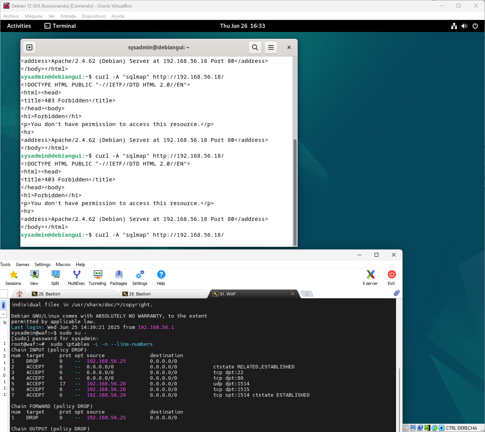
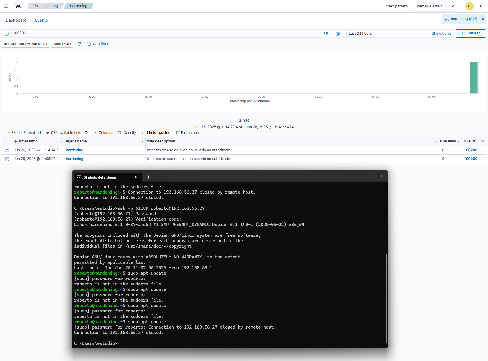

-----

# obligatorio\_SRD

-----
## Docente 
**Mauricio Germán Campiglia Hernández**

## Estudiantes

**Diego Vazquez** 
- CI: 4.874.410-9 
- N° de estudiante: 302392 

**Giovanni Storti** 
- CI: 4.000.995-1
- N° de estudiante: 151234 

## Declaración de autoría 
Nosotros, Diego Vazquez Alberdi y Giovanni Storti Larrama, con documentos de identificación 4.874.410-9 y 4.000.995-1 respectivamente, y estudiantes de la carrera Analista en Infraestructura Informática, en relación con el Obligatorio de **Seguridad en Redes y Datos** para su defensa y evaluación en el curso 2025, declaramos que asumimos la originalidad de dicho trabajo, entendida en el sentido de que no han usado fuentes sin citarlas debidamente.  

## Fecha de entrega
- 26 de junio de 2025
-----

## Índice
* [Introducción](#introducción)
* [Implementación](#implementación)
  * [Hardening](#hardening)
  * * [Automatismo - Ansible](#automatismo-ansible)
    * [Ejecución](#ejecución)
  * [SIEM - Wazuh](#siem---wazuh)
    * [Rules](#rules)
    * [Commands](#commands)
    * [Active-response](#active-response)
    * [Métricas (KPI)](#métricas-kpi)
    * [Evidencias de ejecución](#evidencias-de-ejecución)
  * [WAF - Apache ModSecurity](#waf---apache-modsecurity)
    * [Instalación](#instalación)
      * [Mod security](#mod-security)
      * [Reverse proxy](#reverse-proxy)
      * [Web server](#web-server)
        * [Reglas de Firewall Web server](#reglas-de-firewall-web-server)
    * [Configuraciones WAF](#configuraciones-waf)
      * [SecRuleEngine On](#secruleengine-on)
      * [Reverse proxy](#reverse-proxy)
      * [Reglas de Firewall](#reglas-de-firewall)
      * [Reglas](#reglas)
      * [Evidencia de ejecución](#evidencia-de-ejecución)
  * [Analítica de Usuarios](#analítica-de-usuarios)
    * [Ejemplos de alertas](#ejemplos-de-alertas)
      * [Conexión fuera de hora/día no laboral](#conexión-fuera-de-horadía-no-laboral)
      * [Intentos de escalamiento de privilegios](#intentos-de-escalamiento-de-privilegios)
  * [Solución de Acceso Administrativo - pfSense](#solución-de-acceso-administrativo)
    * [Servidor VPN](#servidor-vpn)
    * [Paquete openvpn-client-export](#paquete-openvpn-client-export)
    * [Client Specific Overrid](#client-specific-overrid)
    * [Alias](#alias)
    * [Reglas](#reglas)
    * [Logs de autenticación](#logs-de-autenticación)
    * [Evidencia de conectividad](#evidencia-de-conectividad)
    * [Evidencias de configuración y pruebas](#evidencias-de-configuración-y-pruebas)
  * [Bibliografía](bibliografia)

-----

## Introducción

En esta propuesta se nos solicita realizar la implementación de una **solución integral de seguridad** para la empresa **Electronic Security Engineering (ESE)**. Dada su naturaleza crítica, su acelerado crecimiento y los riesgos inherentes a su actividad, ESE enfrenta amenazas constantes que comprometen tanto su propiedad intelectual como la disponibilidad y reputación de sus servicios.

Con el objetivo de fortalecer su postura de seguridad frente a estos desafíos, se propone una serie de medidas concretas que abarcan desde el **endurecimiento del sistema operativo** hasta la implementación de **tecnologías avanzadas de monitoreo, control de accesos y análisis de amenazas**. La solución considera tanto la defensa perimetral como la detección proactiva de incidentes, haciendo uso de herramientas de código abierto y buenas prácticas de la industria.

A continuación, se detalla el conjunto de requerimientos a implementar:

1.  **Hardening del Sistema Operativo Linux**

      * Realizar hardening sobre Debian 10, 11 o 12 siguiendo los CIS CSC.
      * **Acciones mínimas:**
          * Deshabilitar servicios innecesarios.
          * Configurar políticas de contraseñas seguras y autenticación multifactor (MFA).
          * Aplicar parches de seguridad y actualizaciones del sistema.
          * Configurar firewall local con reglas de acceso estrictas.
          * Implementar auditoría de sistema para detectar cambios no autorizados en archivos críticos.
          * Automatizar recolección remota de telemetría (procesos, usuarios, conexiones, software instalado, parches).

2.  **Implementación de un SIEM (Wazuh)**

      * Desplegar Wazuh para monitorear, analizar y correlacionar eventos de seguridad (incluyendo WAF y servidor Linux).
      * **Se configurará:**
          * Al menos 3 casos de uso de detección y respuesta automatizada con correlación de eventos no triviales.
          * Al menos 3 KPIs clave para visualizar en una consola de mando.

3.  **Implementación de un Web Application Firewall (WAF)**

      * Configuraremos un WAF en modo *reverse proxy* para proteger el portal web.
      * Debe cubrir mínimo las amenazas **OWASP Top Ten** (SQLi, XSS, tráfico malicioso).
      * **Requisitos:**
          * Bloqueo de ataques en tiempo real sin afectar el rendimiento.
          * Puede funcionar autónomamente o integrado con el SIEM.
          * Crear al menos 3 políticas personalizadas.
          * Integrar el WAF con el SIEM para monitoreo centralizado.

4.  **Analítica de Autenticación de Usuarios**

      * Implementaremos en el SIEM analítica de autenticación para:
          * Correlacionar actividades sospechosas.
          * Detectar y reaccionar ante posibles compromisos de credenciales.
          * Bloquear usuarios potencialmente comprometidos.

5.  **Solución de Acceso Administrativo**

      * Configuraremos una VPN de administración para usuarios privilegiados.
      * **Requisitos:**
          * Protección con autenticación multifactor.
          * Registro completo de autenticaciones y actividades.
          * Configurar control de acceso granular con al menos dos roles diferentes.

-----

## Implementación

### Hardening

**Aclaración:**
Se realiza la instalación de **Debian 12 minimal** que viene con SSH server y las standard system utilities. Por este motivo no es necesario deshabilitar procesos innecesarios. El usuario Sysadmin es creado al momento de la instalación. Esta parte del proceso no está automatizado.  


  - Creamos claves públicas/privadas para los usuarios **Sysadmin** (con *passphrase*) que es el administrador de los sistemas y Ansible.

## Automatismo-Ansible

Utilizamos **Ansible** para la automatización desde un servidor *bastion*.

 - **Estructura**
```
sysadmin@bastion:~/obligatorio_SRD$ tree .
.
├── ansible.cfg
├── deploy_42.sh
├── inventory
│   ├── hosts.ini
│   └── vars
│       └── linux_vars.yml
├── playbooks
│   ├── bootstrap.yml
│   └── playhard.yml
├── README.md
└── roles
    └── hardening
        ├── files
        │   └── wazuh_scripts
        │       ├── block_access_no_authorized.sh
        │       ├── block_sudo_su_no_authorized.sh
        │       └── white_users.list
        ├── handlers
        │   └── main.yml
        ├── tasks
        │   ├── auditd.yml
        │   ├── filesystem_modules.yml
        │   ├── googleauthenticator.yml
        │   ├── iptables.yml
        │   ├── main.yml
        │   ├── no_ssh_root.yml
        │   ├── packages.yml
        │   ├── password_policies.yml
        │   ├── time_sync.yml
        │   ├── updates_upgrades.yml
        │   ├── velociraptor.yml
        │   └── wazuh_agent.yml
        └── templates
            ├── auditd_rules
            │   ├── access.rules.j2
            │   ├── actions.rules.j2
            │   ├── delete.rules.j2
            │   ├── logins.rules.j2
            │   ├── MAC-policy.rules.j2
            │   ├── modules.rules.j2
            │   ├── mounts.rules.j2
            │   ├── perm_mod.rules.j2
            │   ├── privilege_persistence.rules.j2
            │   ├── session.rules.j2
            │   └── system_locale.rules.j2
            └── sshd.pam.j2

```


## Ejecución 
<br>

El automatismo parte de un script llamado `"deploy_42.sh"` que acciona 2 *playbooks* llamados `"bootstrap.yml"` y `"playhard.yml"`.

Con Sysadmin ejecutamos `"bootstrap.yml"` y preparamos el ambiente en el *host*:

  - Crea el usuario Ansible y se le da permisos de `sudo` sin contraseña.
  - Copia las claves públicas de Sysadmin y Ansible.
  - Cambia el puerto por defecto de SSH al `61189`.

Con Ansible ejecutamos `"playhard.yml"` que contiene el rol `"hardening"` con las siguientes *"tasks"*:

  - Se sincronizará la hora para evitar problemas de instalación de paquetes, además de que es un requerimiento para el MFA. *- Se agregó este paso porque al utilizar máquinas clonadas que no tenían la hora actualizada o demoraba en actualizar -*
  - 
 - Se actualizan **paquetes del sistema** (`apt update – apt upgrade`).  | [YML](roles/hardening/tasks/updates_upgrades.yml) |<br>
 **Evidencia de ejecución:** <br>
  

- Se instalan **paquetes necesarios** para el resto de las tareas.  | [YML](roles/hardening/tasks/packages.yml) |<br>
**Evidencia de ejecución:** <br>
 

- Se deshabilita el **login de *root*** por SSH. |  [YML](roles/hardening/tasks/no_ssh_root.yml) |<br>
**Evidencia de ejecución:** <br>
  

- Se deshabilitan **módulos de *filesystem*** innecesarios para reducir superficie de ataque. |  [YML](roles/hardening/tasks/filesystem_modules.yml) |<br>
**Evidencia de ejecución:** <br>
  

- Se aplican reglas de **Auditd** para auditar cambios en archivos del sistema que sean posible señal de actividad maliciosa.  | [YML](roles/hardening/tasks/auditd.yml) |<br>
**Evidencia de ejecución:** <br>
 

- Se configuran reglas de **iptables** para filtrar tráfico entrante y saliente.  | [YML](roles/hardening/tasks/iptables.yml) |<br>
**Evidencia de ejecución:** <br>
 

- Se aplican **políticas de contraseña** endureciendo los criterios por defecto.  | [YML](roles/hardening/tasks/password_policies.yml) |<br>
**Evidencia de ejecución:** <br>
 

- Se configura MFA con **Google Authenticator**. Los usuarios Sysadmin, Ansible y Root no utilizan GA.  | [YML](roles/hardening/tasks/googleauthenticator.yml) |<br>
**Evidencia de ejecución:** <br>
 

- Se instala el agente de **Wazuh** y se copian los scripts que se utilizarán para el bloqueo de usuarios.  | [YML](roles/hardening/tasks/wazuh_agent.yml) |<br>
**Evidencia de ejecución:** <br>
 

- Se instala el agente de **Velociraptor** para recolectar datos de telemetría. El servidor *Bastion* es el que auspicia de *server*.  | [YML](roles/hardening/tasks/velociraptor.yml) |<br>
**Evidencia de ejecución:** <br>
 
<br>

-----

### SIEM - Wazuh

Para la implementación de Wazuh utilizamos el OVA disponible en la página oficial:
[https://packages.wazuh.com/4.x/vm/wazuh-4.12.0.ova](https://packages.wazuh.com/4.x/vm/wazuh-4.12.0.ova)


#### Rules

**Reglas 100100 y 100101**
Estas reglas funcionan en conjunto para monitorear las conexiones fuera de horario laboral 20:00 – 7:59 UTC -3 (en la regla figura como 23:00 – 10:59 hora UTCO porque el reloj interno de Wazuh lo toma así) y conexiones en días no laborables.

```xml
<group name="policy_violation,">
  <rule id="100100" level="10">
    <if_group>authentication_success</if_group>
    <time>23:00 - 10:59</time>
    <description>Conexión fuera del horario laboral</description>
    <group>login_time,pci_dss_10.2.5,pci_dss_10.6.1,gpg13_7.1,gpg13_7.2,gdpr_IV_35.7.d,gdpr_IV_32.2,hipaa_164.312.b,nist_800_53_AU.14,nist_800_53_AC.7,nist_800_53_AU.6,</group>
    <mitre>
      <id>T1078</id>
    </mitre>
  </rule>

  <rule id="100101" level="10">
    <if_group>authentication_success</if_group>
    <weekday>saturday,sunday</weekday>
    <description>Conexión días no laborables</description>
    <mitre>
      <id>T1078</id>
    </mitre>
    <group>login_day,pci_dss_10.2.5,pci_dss_10.6.1,gpg13_7.1,gpg13_7.2,gdpr_IV_35.7.d,gdpr_IV_32.2,hipaa_164.312.b,nist_800_53_AU.14,nist_800_53_AC.7,nist_800_53_AU.6,tsc_CC6.8,tsc_CC7.2,tsc_CC7.3,</group>
  </rule>
</group>
```

**Reglas 100200 y 100201**
Estas reglas detectan cuando un usuario no autorizado intenta utilizar "sudo" o "su".

```xml
<group name="privilege_escalation_detection">
  <rule id="100200" level="12" frequency="3" timeframe="30">
    <if_matched_sid>5405</if_matched_sid>
    <match>sudo</match>
    <program_name>sudo</program_name>
    <description>Intentos de uso de sudo en usuario no autorizado</description>
    <group>auth_failed,sudo_attempt</group>
  </rule>

  <rule id="100201" level="12" frequency="6" timeframe="30">
    <if_matched_sid>5503</if_matched_sid>
    <match>su</match>
    <program_name>su</program_name>
    <description>Intentos de uso de su en usuario no autorizado</description>
    <group>auth_failed,su_attempt</group>
  </rule>
</group>
```

**Reglas 100300**
Esta regla detecta el intento fallido de conexiones ssh y bloquea .
```xml
<group name="auth_distributed,ssh,custom,">
  <!-- Mismo usuario sin contexto -->
  <rule id="100300" level="10" frequency="2" timeframe="60">
    <if_matched_sid>5716</if_matched_sid>
    <same_user />
    <description>Intentos fallidos del mismo usuario</description>
    <group>authentication_failed,distributed_login</group>
  </rule>
</group>
```

**Regla 100500**
Esta regla trabaja en conjunto con el WAF. Cuando el WAF bloquea intentos de ataques, esta regla se dispara para que *active response* mande la señal de bloqueo de IP.

```xml
<group name="apache,web,">
  <rule id="100500" level="14" frequency="5" timeframe="120">
    <if_matched_sid>30411</if_matched_sid>
    <same_srcip />
    <description>Ataques reiterados WEB</description>
  </rule>
</group>

```

#### Commands

Utilizamos un script de Wazuh llamado `firewall-drops` y creamos 2 scripts para el bloqueo de usuarios.

```xml
 <command>
  <name>block_sudo_su_no_authorized</name>
  <executable>block_sudo_su_no_authorized.sh</executable>
  <timeout_allowed>no</timeout_allowed>
</command>

<command>
  <name>block_access_no_authorized</name>
  <executable>block_access_no_authorized.sh</executable>
  <timeout_allowed>no</timeout_allowed>
</command>

```

Estos scripts bloquean a los usuarios y matan la sesion al instante, la diferencia entre ellos es el parámetro sobre el que actúan: uno sobre el *source user* (`srcuser`) y el otro sobre *destination user* (`dstuser`).

  * `block_access_no_authorized.sh`

      * Utiliza el `dstuser`.

  * `block_sudo_su_no_authorized.sh`

      * Utiliza el `srcuser`.

#### Active-response

```xml
<active-response>
  <command>firewall-drop</command>
  <location>local</location>
  <level>12</level>
  <rules_id>100300,100500</rules_id>
</active-response>

<active-response>
  <command>block_sudo_su_no_authorized</command>
  <location>local</location>
  <level>10</level>
  <rules_id>100200,100201</rules_id>
</active-response>

<active-response>
  <command>block_access_no_authorized</command>
  <location>local</location>
  <level>10</level>
  <rules_id>100100,100101</rules_id>
</active-response>
```

Se creó una *white list* para los usuarios `sysadmin`, `ansible`, `root` y posibles usuarios que necesiten conectarse en un horario no laboral como un usuario de *backup*.

<br>
<br>

## Métricas (KPI)
<br>
Se definieron tres  KPI (Key Performance Indicator, o Indicador Clave de Desempeño) para evaluar la eficacia y eficiencia de las estrategias de seguridad informática dentro de la organización, que nos permiten mantener un monitoreo constante y ayudarnos a tomar decisiones ante incidentes. 

**Gráfico de alertas criticas vs alertas totales:**

   * Grráfico circular donde sea realizara una comparativa de las alertas críticas de nivel 10 a nivel 15 sobre el total de las alertas. 

   * Este KPI nos permite detectar cuando el nivel de alteras críticas supera el umbral esperado de un 5% del total de las alertas. Permitiendo evaluar si las acciones de seguridad propuestas están siendo efectivas. 

**Indicador de alertas críticas en las últimas 24 horas**

   * Contador que mide la cantidad de alertas críticas que se dieron en las últimas 24hs

   * Este KPI nos permite ver actividad reciente de alto riesgo. Tambien ayuda a validar las acciones de respuesta automática implementadas.  

**Grafica de ataques a la web por unidad de tiempo**

   * Gráfico de línea que un registro de ataques a la página web em función del tiempo. 

   * Este KPI nos permite monitorear, detectar amenazas y validar la efectividad del WAF y los active response ante distintos ataques (XSS, SQLi, User-Agent malicioso, Referer anómalo, etc.). 
<br>
<br>


## Evidencias de ejecución
<br>
En la siguiente link se puenden ver evidencias de ejecución de las reglas. [Evidencia](documents/images/2-Wazuh)

<br>
<br>
-----

## WAF - Apache ModSecurity

Para la implementación del WAF se siguieron los siguientes pasos:

### Instalación

#### Mod security

[https://www.digitalocean.com/community/tutorials/how-to-set-up-mod\_security-with-apache-on-debian-ubuntu](https://www.digitalocean.com/community/tutorials/how-to-set-up-mod_security-with-apache-on-debian-ubuntu)

#### Reverse proxy

[https://www.digitalocean.com/community/tutorials/how-to-use-apache-as-a-reverse-proxy-with-mod\_proxy-on-debian-8](https://www.digitalocean.com/community/tutorials/how-to-use-apache-as-a-reverse-proxy-with-mod_proxy-on-debian-8)

#### Web server** 

```xml
<VirtualHost *:8080>
        ServerAdmin webmaster@localhost
        DocumentRoot /var/www/html

        ErrorLog ${APACHE_LOG_DIR}/error.log
        CustomLog ${APACHE_LOG_DIR}/access.log combined
</VirtualHost>
```

Se deja escuchando solo el puerto 8080:<br>
`/etc/apache2/ports.conf`

```bash
#Listen 80
Listen 8080
```

#### Reglas de Firewall Web server

```bash
Chain INPUT (policy DROP)
num   target        prot opt source                destination
1     ACCEPT        0    --  0.0.0.0/0             0.0.0.0/0             ctstate RELATED,ESTABLISHED
2     ACCEPT        6    --  192.168.56.0/24       0.0.0.0/0             tcp dpt:22 ctstate NEW
3     ACCEPT        6    --  192.168.56.18         0.0.0.0/0             tcp dpt:8080 ctstate NEW

Chain FORWARD (policy DROP)
num   target        prot opt source                destination

Chain OUTPUT (policy ACCEPT)
num   target        prot opt source                destination
1     ACCEPT        17   --  0.0.0.0/0             0.0.0.0/0             udp dpt:53
2     ACCEPT        6    --  0.0.0.0/0             0.0.0.0/0             tcp dpt:53
3     ACCEPT        6    --  0.0.0.0/0             0.0.0.0/0             tcp dpt:80
4     ACCEPT        6    --  0.0.0.0/0             0.0.0.0/0             tcp dpt:443
```
<br>

#### Configuraciones WAF

#### SecRuleEngine On 


#### Reverse proxy

```xml
<VirtualHost *:80>
        ServerAdmin webmaster@localhost
        ProxyPreserveHost On

        ProxyPass / http://192.168.56.101:8080/
        ProxyPassReverse / http://192.168.56.101:8080/

        ErrorLog ${APACHE_LOG_DIR}/error.log
        CustomLog ${APACHE_LOG_DIR}/access.log combined

</VirtualHost>
```

#### Reglas de Firewall

```bash
Chain INPUT (policy DROP)
num  target     prot opt source               destination
1    ACCEPT     0    --  0.0.0.0/0            0.0.0.0/0            ctstate RELATED,ESTABLISHED
2    ACCEPT     6    --  0.0.0.0/0            0.0.0.0/0            tcp dpt:22
3    ACCEPT     6    --  0.0.0.0/0            0.0.0.0/0            tcp dpt:80
4    ACCEPT     17   --  192.168.56.20        0.0.0.0/0            udp dpt:1514
5    ACCEPT     6    --  192.168.56.20        0.0.0.0/0            tcp dpt:1515
6    ACCEPT     6    --  192.168.56.20        0.0.0.0/0            tcp spt:1514 ctstate ESTABLISHED

Chain FORWARD (policy DROP)
num  target     prot opt source               destination

Chain OUTPUT (policy DROP)
num  target     prot opt source               destination
1    ACCEPT     0    --  0.0.0.0/0            0.0.0.0/0            ctstate RELATED,ESTABLISHED
2    ACCEPT     6    --  0.0.0.0/0            192.168.56.101       tcp dpt:8080 ctstate NEW
3    ACCEPT     17   --  0.0.0.0/0            0.0.0.0/0            udp dpt:53
4    ACCEPT     6    --  0.0.0.0/0            0.0.0.0/0            tcp dpt:80
5    ACCEPT     6    --  0.0.0.0/0            0.0.0.0/0            tcp dpt:443
6    ACCEPT     17   --  0.0.0.0/0            192.168.56.20        udp dpt:1514 ctstate NEW,ESTABLISHED
7    ACCEPT     6    --  0.0.0.0/0            192.168.56.20        tcp dpt:1515 ctstate NEW,ESTABLISHED
8    ACCEPT     6    --  0.0.0.0/0            192.168.56.20        tcp dpt:1514 ctstate NEW,ESTABLISHED
```

#### Reglas

**Regla 1**
Bloquea intentos de usuarios que quiera utilizar `wget`, `sqlmap`, `pyth`, `nmap`. Si se usa deniega el acceso (403).

```bash
SecRule REQUEST_HEADERS:User-Agent "@rx (?i)(wget|sqlmap|python|nmap)" \
  "id:50001,phase:1,deny,status:403,log,msg:'Bloqueo de User-Agent sospechoso'"
```
**Evidencia de ejecución**<br>

<br>
<br>
**Regla 2**
Bloquea URLs que intentan acceder a archivos sensibles con extensiones `.zip`, `.sql`, `.bak`, `.env`, `.git`, `.log`. Si se detecta deniega el acceso (403).

```bash
SecRule REQUEST_URI "@rx \.(zip|sql|bak|env|git|log)$" \
  "id:50002,phase:1,deny,status:403,log,msg:'Intento de descarga de archivo sensible'"
```
**Evidencia de ejecución**<br>

<br>
<br>
**Regla 3**
Bloquea el acceso al sitio cuando detecta que el encabezado tiene un *referer* externo que no coincide con el dominio de nuestra página web.

```bash
SecRule REQUEST_HEADERS:Referer "!@contains 192.168.56.18" "chain,id:3005,phase:1,deny,status:403,log,msg:'Referer externo no autorizado (acceso por IP)'"
  SecRule REQUEST_HEADERS:Referer "!@streq ''"
```
#### Evidencia de ejecución 

<br>

-----

## Analítica de Usuarios

Para la detección de actividades sospechosas de usuarios utilizamos las reglas de Wazuh 100100, 100101, 100200 y 100201 así como también utilizamos las reglas de **Auditd** para monitorear cambios en archivos del sistema que son críticos.

#### Ejemplos de alertas


#### Conexión fuera de hora/día no laboral  
<br>


<br>
#### Intentos de escalamiento de privilegios




-----

## Solución de Acceso Administrativo

Utilizamos **pfSense** para implementar una solución de acceso remoto mediante VPN para el acceso administrativo a la red.


<br>
<br>
#### Servidor VPN
<br>


<br>
<br>
#### Paquete openvpn-client-export
Instalamos el paquete `openvpn-client-export` para la exportación de la configuración y el certificado VPN. Consideramos como MFA el uso de certificado (algo que tengo) y usuario y contraseña (algo que sé). <br>
*Si bien figura Free Radius en este caso no es implementó. Podría tomarse como mejora a furuto* <br>

.png) <br>
<br>
<br>
#### Client Specific Overrid
Para mayor control y rastreo se define en la funcionalidad de *Client Specific Override* una IP fija para cada usuario.<br>
Esto sirve tambien para disernir que usuario es administrador y cual no, ya que segun la ip que asigemos va a tener diferentes accesos. Esto lo vemos en el siguiente punto.


<br>
Ejemplo de usuario administrador


<br>
<br>
#### Alias 
Utilizamos alias para abarcar todas las IP del rango de VPN para Administradores y otro alias para Usuarios:

  - **Administradores:** 192.168.200.2-50
  - **Usuarios:** 192.168.200.51-200

 Generamos alias para apuntar a las redes según el rol:
  - **LAN\_ADMINISTRACION:** 192.168.10.0/24 192.168.20.0/24
  - **LAN\_USUARIOS:** 192.168.20.0/24


<br>
<br>
#### Reglas
Las reglas aplicadas permiten que los administradores tengan acceso a las LAN, mientras que los usuarios solo pueden acceder a una sola y se les bloquea también el acceso al mismo pfSense


<br>
<br>

#### Logs de autenticación
El registro de autenticación de los usuarios en este caso lo veremos en el **System Logs** de pfSense <br>


#### Evidencia de conectividad
Administrador
<br>
<br>
Usuario 
<br>
<br>
<br>
#### Evidencias de configuración y pruebas
Para ver más configuraciones y pruebas acceder a este link [Evidencia](documents/images/5-Acceso_administrativo)

<br>
-----

## Bibliografía
[Material consultado](documents/Bibliografía.txt)

-----
FIN
-----
